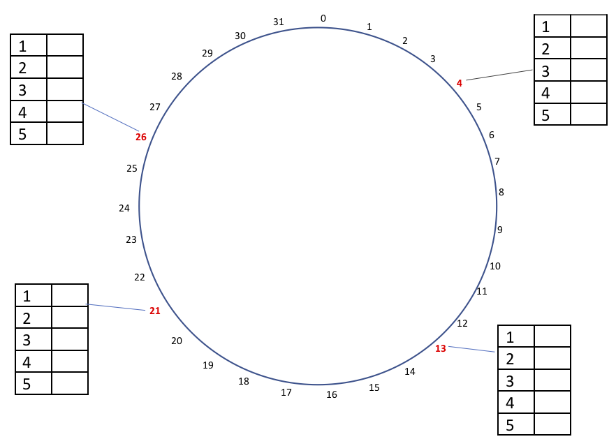
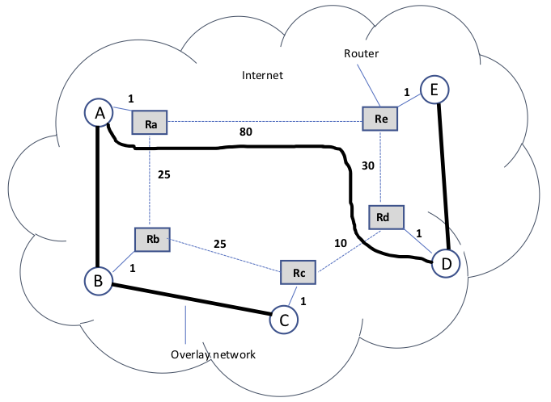

### Oppgave 1 - Processes and Communication

Differentiate between the following:

a. Persistent and transient communication

b. Synchronous and asynchronous communication

c. Concurrent and Iterative servers

d. Stateful and stateless servers

e. Multithreaded clients and multithreaded servers

### Oppgave 2 - Naming, Replication and Fault Tolerance

The figure below shows a chord ring that implements a distributed hash table of m=5bits to provide fault tolerance and availability of service.
Four servers 4, 13, 21, and 26 (bold and red) are replicated to provide exactly the same services to clients.
Each server replica maintains five finger table entries.

Use this figure to answer the questions below:

1. Compute the finger table for each replica
2. What is the address size for this ring?
3. Resolve key = 10 from server replica 26 (show your steps)
4. Resolve key = 5 from server replica 4 (show your steps)
5. Which server replicas are responsible for the keys = 0, 4, 15, 16, 24, 26, and 30? (show the formula you used)

### Oppgave 3 - Communication

An overlay network is formed by 5 processes to be used to multicast messages as shown in the above figure. Process C is at the root of the multicast tree.
The delays between the routers for the physical network are given. Use this figure to answer the following questions

1. What is the delay in the overlay network when a message is multicast from C to D?
2. What is the delay in the overlay network when a message is multicast from C to E?
3. Compute the stretch/relative delay penalty (RDP) when a message is multicast from C to E provided that
the best path (least-cost) will be used by the underlying physical routers to route message from C to E
4. if the tree is modified such that path A -> D is removed and a new path A -> E is created 
resulting in a new path for the tree as: C -> B -> A -> E -> D. Compute the relative delay penalty to route message from C to E.
5. Based on your calculations in (3) and (4), which tree would be more efficient to route a message from C to E? Explain your answer.

### Oppgave 4 - Replication and Consistency

1. Describe the benefits and challenges of replication in a distributed system
2. Differentiate between Remote-write protocols and Local-write protocols

### Oppgave 5 - Coordination

1. Differentiate between lamport clock and vector clock
2. Discuss how distributed algorithm works in mutual exclusion algorithm
3. Discuss how centralized algorithm works in mutual exclusion algorithm
4. Discuss how token-ring algorithm works in mutual exclusion algorithm
5. Explain briefly how bully election algorithm works

### Oppgave 6 - Fault-Tolerance

1. Explain how process resilience can be achieved in distributed system
2. Differentiate between flat process group and hierarchical process group and discuss their benefits and drawbacks
3. Explain feedback implosion and how to use nonhierarchical feedback control to mitigate it
4. Discuss briefly the five classes of failures that can occur in RPC systems

### Oppgave 7 - Security

Discuss the cryptography schemes that can be used to provide confidentiality, integrity, authentication, and non-repudiation.

### Oppgave 8 - Cloud Computing

Explain the following cloud service models:

a. Infrastructure as a service

b. Platform as a service

c. Software as a service

### Oppgave 9 - Multiple-choice

You can practice all the weekly quizzes. 
