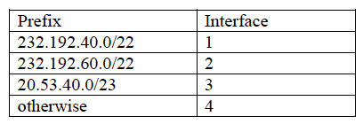
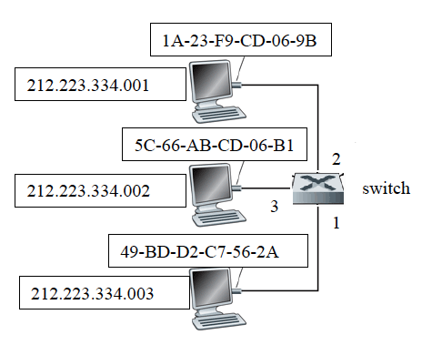

### Oppgave 1 - Layering and services

a.	Hvilke fem nivåer består TCP/IP protokollstakken av?

b.	Angi for hver av følgende protokoller det nivået i TCP/IP protokollstakken hvor protokollen er implementert:

 - Domain Name System Protokollen (DNS)
 - Internet Control Message Protocol (ICMP)
 - Ethernet IEEE 802.3
 - Dynamic Host Configuration Protocol (DHCP)

c.	Hvilke nivåer av TCP/IP protokollstakken implementeres på routere? Hvilke på nivåer implementeres på en hosts?

d.	Hva ligger i begrepene *multiplexing* og *demultiplexing* innen protokoller? Gi eksempel der de anvendes innen TCP/IP protokollstakken.

e. Forklar hva som er forskjellen mellom en *hub* og en *switch*

### Oppgave 2 - Transport protocols

Følgende figur viser formatet for de segmenter som utveksles i UDP protokollen.

a. Gjør kort rede for hvilken tjeneste UDP protokollen stiller til rådighet samt funksjonen av feltene: Source port, Dest port, Length, Checksum og Application data (som angitt på figuren ovenfor).

b. Anta i det følgende en konfigurasjon av Go-Back-N (GBN) protokollen med vindustørrelse på 3 og hvor de første tre datapakker med sekvensnumrene 1, 2, og 3 avsendes.
Hvordan vil protokollen reagere hvis alle tre datapakker går tapt?

c. Hva vil skje hvis alle tre datapakker kommer frem og kun acknowledgement på datapakke 3 kommer tilbake?

d.	Foreslå et pakkeformat som kan brukes til å implementere GBN protokollen hvis sekvensnumre er 3-bits og data-delen kan være mellom 0 og 127 (27) bits.

### Oppgave 3 - Network layer and routing

a. Hvilket 32-bits bitmønster svarer IP adressen 232.192.40.7 til? Tabellen nedenfor med 2 potenser kan være nyttig.

b. Betrakt CIDR (Class Internet Domain Routing) adresseblokken 232.192.40.0/22. Hvilket intervall av adresser utgjør denne blokken?

c. Betrakt en router med følgende forwarding tabell:

På hvilket interface vil routeren videresende pakker med følgende destinasjon IP adresser (svarene skal begrunnes):
- 232.192.57.14
- 232.192.42.10
- 20.53.40.7

### Oppgave 4 - Link layer and addressing

Betrakt følgende lokale nettverk bestående av tre hosts (med IP adresser og MAC adresser som angitt på figuren) og en switch med interfaces 1-3 (som angitt på figuren).

Anta at ARP tabeller på hosts ikke inneholder noen innganger og at switch-tabellen på switchen er tom.

Hva vil innholdet av ARP tabell på host med IP adresse 212.223.334.003 være etter at det er sendt et IP datagram fra 212.223.334.003 til 212.223.334.002. Hva vil innholdet av switch-tabellen i switchen være? (Svarene skal begrunnes)

### Oppgave 5 - Project work

Gjør rede for hvilke tre protokollnivå som dere implementerte i prosjekt 1: Network Programming.

### Oppgave 6 - Packet-switched networks

Problems P6, P10 og P11 i nettverksboken Kap. 1.

##### A small exercise - fra forelesning 2 (Lecture 2)

Assume:
 - Transmission rate, R = 100 Mbps
 - Packet length, L = 10000 bits
 - Distance between router A and B, d = 5000 meters
 - Signal propagation speed, s = 2 * 108 meters/second
 - Processing delay, dproc =  100µs (0,1 ms)
 - Queuing delay, dqueue = 20ms

Compute: transmission delay, propagation delay, and nodal delay

### Oppgave 7 - Network layer and routing

- Review Questions R9, R17, R20, R21, R22, R24 i nettverksboken Kap. 4
- Problems P1, P5, P6, P7, P8, P11, P12, P14, P15, P16 i nettverksboken Kap. 4
- Review Question R5 i nettverksboken Kap. 5
- Problems P3, P8 i nettverksboken Kap. 5. Om slike oppgaver kommer på eksamen da vil algoritmen bli gitt med som en del av eksamen.

- Slides 18, 19, 20 fra forelesning F19 (Lecture 19): Angi subnets og subnetadresser; forwardingtabeller for hosts og routere?

- Slide 19 fra forelesning F20 (Lecture 20)

### Oppgave 8 - Link Layer and local area networks

- Review Questions R10, R11, R12, R13, R15 i nettverksboken Kap. 6.
- Problems P14, P15, P16, P21, and P22 i nettverksboken Kap. 6.
- Slide 33 fra forelesning 27 (Lecture 27)

### Oppgave 9 - Overblikk og sammenheng

Les (og forstå) Kap 6.7 i nettverksboken

### Oppgave 10 - Multiple-choice

Spørsmål om nettverksdelen fra de ukenlige quiz'er
