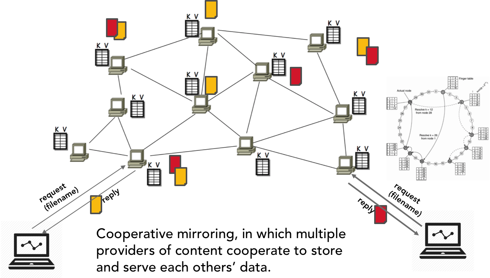
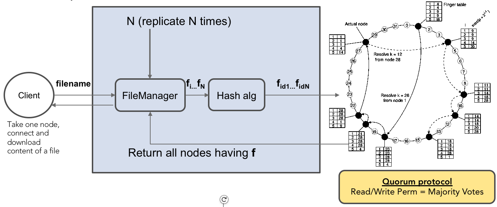

## **** WARNING PROJECT UNDER CONSTRUCTION ****

### Project 3 - Weeks 12 and 13: 25/03 - 05/04

### DHT Cooperative Mirroring with Quorum-based consistency protocol

The project assumes that you have read and understood the following sections in the Distributed system book:
- Section 5.2 - Distributed hash tables (DHT) (Naming)
- Section 6.3 - Decentralized algorithm (Coordination)
- Section 7.5 - Quorum-based protocols (Consistency and Replication)

Therefore the project builds on exercise 7 - Chord Distributed Hash Table (https://github.com/selabhvl/dat110public/tree/master/week7/ChordDHT)

### Description of project
This implementation is based on synchronous communication by using the Java RMI remote procedure call (RPC)
The system works under these models and assumptions
- Our quorum-based protocol uses strict, sequential consistency model and replicated write protocol
- We assume no message loss during communications
- We assume that network is stable and there is no communication failure

A DHT can be used to build a cooperative mirroring peer-to-peer distributed system in which multiple providers of content cooperate to store and serve each others’ data.

The idea behind cooperative mirroring is that a node can replicate its content among other nodes in the p2p system. In the DHT implementation, this replication is done dynamically where nodes can be assigned a file if the hash value (keyid) of a replica of this file maps to the hash value (id) of the node by using the rule (id >= keyid).

We use a simple implementation where a node, once it has successfully joined a chord ring, distributes it file by multicasting the hash of the file name and the initial content to the ring. 
- Replicas are first created by calling createReplicaFiles(filename) in the FileManager.
- Next replicas are distributed to the nodes in the ring by resolving the replica name from the node
- When a remote node is mapped to a replica, a remote rpc is invoked on createFileInNodeLocalDirectory(sendercontent, replicahashid) of the remote node. If successful, a replica file with the name - replicahashid and content - sendercontent are created in the remote node. 

A file can then be looked up by any client from any node in the ring (see the fig). The resolution for a file starts from this node.

The current implementation of the project allows the simulation of chord ring in a single machine environment.
To use multi computer simulation requires two slight modifications. 
1. In the Node class constructor - change the setNodeIP to use the IP address of the machine (setNodeIP(InetAddress.getLocalHost().getHostAddress())) instead of setNodeIP(nodename). 
2. In the Util class, use registry = LocateRegistry.getRegistry(ipaddress, StaticTracker.PORT) and comment out registry = LocateRegistry.getRegistry(StaticTracker.PORT);

When these changes are made, you can then start the chord project on different machines.

The ChordDHT is provided to you as a complete system that allows you to test read and write requests from any client and also test the quorum-based consistency protocol. Warning! You'll get many messages in the console when you run each chordNode, you may remove them in the code.

### ChordDHT Project organisation

##### no.hvl.dat110.rpc.interfaces
- ChordNodeInterface: The interface class where remote functions for each node are defined.
- QuorumInterface: Interface for the quorum algorithm

##### no.hvl.dat110.node
- Node: implements the ChordNodeInterface with its attributes and methods. For example, a node has an IP address, an identifier (hash of the IP address), finger table list, key id list, and so on. In addition, a node can be called to lookup any key id. Therefore, the method findSuccessor(keyid) and findHighestPredecessor(keyid) are directly implemented in node. In addition, the predecessor P of the successor S of node N can be notified that it has a new predecessor N, if P is between N and S after a remote call. This is implemented as P.notifySuccessor(N) and it's usually called during stabilize ring operation.
- Message: This is used to store the message we want to send among the nodes. It is also used to send back acknowledgements to the sender process. 
- Operations: The class handles the actual read and write requests and operations from the client processes.
- OperationType: An enum where the read and write types are defined

- NodeInformation: used to print out information about the status of the node (IP, ID, finger table entries, current keys)

##### no.hvl.dat110.node.client.test
- NodeClientReader: 
- NodeClientWriter:
- NodeClientTester: class that can be run to lookup a keyid of a file and obtain all the active nodes that is responsible for all replicas of the file. The file id needs to be specified in the class.
- NodeClient: class that can be run to lookup a keyid of a file replica and obtain the node that is responsible for it. The replica id needs to be specified in the class.
- ChordRingTest: 

##### no.hvl.dat110.chordoperations
This package contains five classes responsible for specific chord protocols: 
- StabilizeRing: Checks whether a node P's successor is still valid. If P's successor has predecessor Q which is different from P, then P needs to accept Q as its new successor and Q needs to accept P as its new predecessor (via notifySuccessor)
- CheckPredecessor: runs periodically and makes a remote call to a node's predecessor and checks whether it's still valid. If call fails, predecessor is removed
- FixFingerTable: runs periodically to update the finger table for each node.
- UpdateSuccessor: runs periodically to set the first pointer of the finger table to the correct successor
- JoinRing: calls once when the node is being created to determine whether to join an existing ring or to start a new ring. It uses initial addresses from the StaticTracker class to determine who and where to join a ring.
- LeaveRing: runs periodically until the specified sleep time after which it the node leaves the ring. runs periodically and shutdown the node when the specified ttl is reached or program loops forever if loopforever = true

##### no.hvl.dat110.file
- FileManager: contains methods for creating replicas of a file, distributing those replicas among active nodes in the chord ring, and looking up the active nodes responsible for a given file by iteratively resolving the replicaid (hash of replica) from an active node.
The FileManager can also be run periodically by each chord node to distribute files to new nodes that just joined the ring. (This may not be necessary as stabilize ring protocol 

##### no.hvl.dat110.rpc
- ChordNodeContainer: This is the 'server' for the node where the registry is started and where the binding of the remote stub object for the Node is done. In addition, all periodic chord operations are started in this class currently.

- StaticTracker: class that defines the ip addresses of possible active nodes in a ring. In addition, the port for the registry is specified in this class and the number of times a file should be replicated

##### no.hvl.dat110.util
- Hash: implements hash function method and converts the hash value to big integer. Also, it implements a custom modulo 2^mbit function for testing purposes (where mbit = 4). The current implementation uses SHA-1 which is a 128bit hash algorithm.
- Util: contains various utility methods for obtaining registry or performing conversion.

### Running the ChordDHT system
1. Specify one valid IP address (multi-machine setup) or process name (single machine testing) in the StaticTracker class (This process class is expected to start be started first to create the ring). You can simply leave the process names as "process1", "process2", "process3", ..., etc.
2. Specify the ttl value to decide how long the node should be alive. If you want the program to run forever, set the run forever variable to true in the ChordNodeContainer. Or increase the sleep time to make it run longer.
3. Run the first ChordNodeContainer class (e.g. process1)
4. Several ChordNodeContainer instances can then be launched. Each must specify addresses of active ChordNodeContainers that are running currently in their StaticTracker class (e.g. "process1", "process2", etc.)
5. Run the NodeClient class to test that a client can contact an active node and request for a file by resolving the file through the contacted node.

### QuorumAlgorithm project organisation

 This project implements the quorum-based protocol. The project uses synchronous rpc communication among the processes. The quorum protocol is a replicated-write protocol where processes vote gain write or read permission to a replicated resource. Assume a file is replicated N times and distributed on N servers, a process that wants to write to a replica file needs to assemble a write quorum (i.e. majority of N servers must give permission). The same process is observed for a read operation.

To prevent read-write and write-write conflicts, the voting algorithm must fulfil two constraints:

- Gifford's method:
1. Nr + Nw > N (prevents read-write conflicts)
2. Nw > N/2  (prevents write-write conflicts)

- A simpler method:
1. Nr = N/2 + 1
2. Nw = N/2 + 1
- This method also prevents both conflicts since each time, a quorum for write or read requires the majority (> N/2). 
 
The implementation should use the simple method. You are provided with the template and code skeleton that helps to reason about the implementation and allows you to test if it works. 

##### no.hvl.dat110.mutexprocess
- MutexProcess: The process that receives read/write request.
- ProcessContainer: The 'server' for the MutexProcess
- Message: This is used to store the message we want to send among the nodes. It is also used to send back acknowledgements to the sender process. 
- Operations: The class handles the actual read and write requests and operations from the client processes.
- OperationType: An enum where the read and write types are defined
- Config: where PORT number is configured

##### no.hvl.dat110.interfaces
- ProcessInterface: Interface class mostly with methods for remote invocation.
- OperationType: An enum where the read and write types are defined

##### no.hvl.dat110.util
- Util: contains various utility methods for obtaining registry or performing conversion. Can be used to get the replica processes.

##### no.hvl.dat110.clients.test
Unit test files to test quorum-based protocols using 10 communicating processes (DO NOT CHANGE THE FILES - THEY WILL BE USED TO TEST THE CORRECTNESS OF YOUR IMPLEMENTATION!). 

### Getting Started

You should start by cloning the Java code which can be found in the github repository

https://github.com/selabhvl/dat110-project3-startcode.git

which contains an Eclipse-project for both the ChordDHT and Quorum protocol with start-code. In addition, it also contains a number of unit tests which can be used for some basic testing of the implemented functionality. The unit-tests should not be modified/removed as they will be used for evaluation of the submitted solution. DO NOT CHANGE MODIFY/REMOVE THE UNIT-TESTS FILES - THEY WILL BE USED TO EVALUATE YOUR IMPLEMENTATION!

In order for the group to use their own git-repository for the further work on the codebase, one member of the group must create an empty repository on github/bitbucket without a README file and without a `.gitignore` file, and then perform the following operations

`git remote remove origin`

`git remote add origin <url-to-new-empty-repository>`

`git push -u origin master`

The other group members can now clone this new repository and work with a shared repository as usual.

There are three major tasks that you will implement in this project:

#### Task 1 - implement a quorum-based consistency protocol

You should use the QuorumAlgorithm template to implement the algorithm correctly. 
- Implement a quorum-based consistency protocol on the template provided. 
- Implement the missing parts in the template (MutexProcess)
- Use the Unit tests provided to test the correctness of your implementation

#### Task 2 - Integrate the Quorum algorithm into the ChordDHT

- Integrate the quorum-based implementation with the chord implementation. The ideal situation is that a node has a Lock each for the files/resources that it is managing. However, for simplicity sake, the current implementation assumes one lock for all the resources being held by a node. It means that a node can only participate in one voting process.

- The second task requires that you integrate the quorum protocol into the chordDHT system.
- To do this, you would need to use the MutexInterface which has already been integrated.
- Your task, would then be to fill in the implementations in the missing methods
- Note that if your previous  implementation of quorum works correctly, it should not be very hard to transfer to the chordDHT (Node) process. Both are very similar.
- Use the unit tests to verify that you have correctly integrated the quorum protocol with ChordDHT

#### Task 3 - Implement Read and Write clients for the DHT
Your task here is to implement clients that can send a read or write request to the chord ring by contacting any of the active node.
- Here you need to implement read and write clients that can make request to any active node in the chord ring.
- Three classes need to be modified
1. FileManager: Implement requestActiveNodesForFile, requestToReadFileFromAnyActiveNode, and requestWriteToFileFromAnyActiveNode methods
2. NodeClientReader: Implement the sendRequest() method
3. NodeClientWriter: Implement the sendRequest() method
- A client would first contact an active node in the ring
- Send the filename with the request
- The FileManager generates keyids for the file replicas and resolve each replica from the contacted node.
- Result is a list of active nodes that have the replicas in their filekey list.
- The client decide which node to contact and retrieve the file
- Use the NodeClientTester and NodeClient as inspiration
- Test your implementation using the unit tests provided with the chord project

### Complete ChordDHT with Quorum protocol

